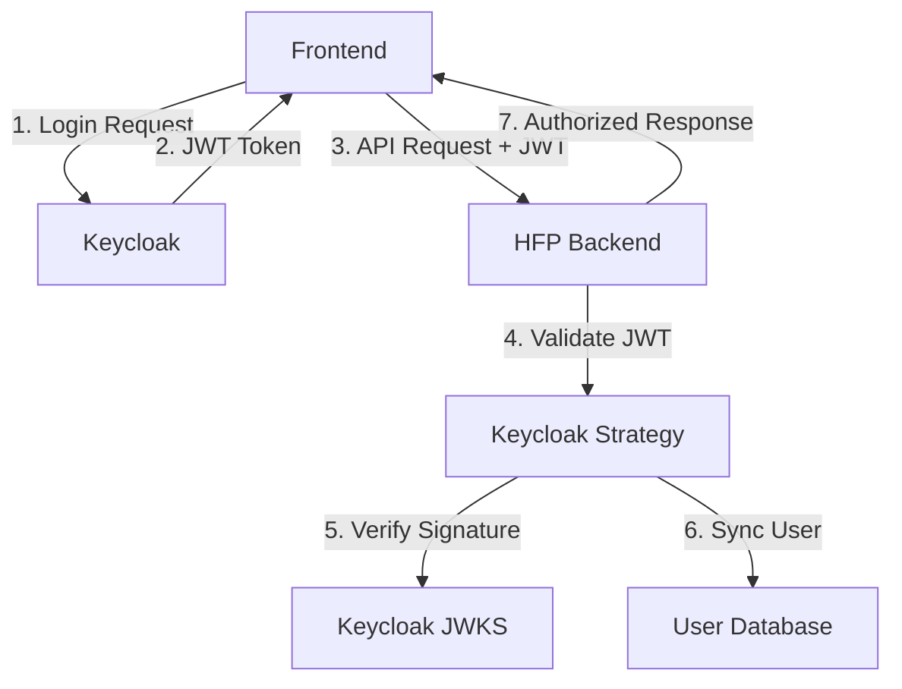

# HFP Keycloak Authentication Setup

## Overview

The Household Financial Platform (HFP) has been successfully integrated with **Keycloak** for enterprise-grade multi-tenant authentication. This setup provides OAuth2/OpenID Connect authentication with JWT token validation, user synchronization, and role-based access control.

## 🚀 Quick Start

### 1. Start Keycloak Services

```bash
cd backend
docker-compose up keycloak-db keycloak -d
```

### 2. Import HFP Realm (Automatic)

The HFP realm is automatically created with the simplified configuration. Test users are pre-configured.

### 3. Test Integration

```bash
./scripts/test-keycloak-integration.sh
```

### 4. Start HFP Backend

```bash
npm run start:dev
```

## 🏗️ Architecture

### Authentication Flow



### Component Integration

- **Keycloak Server**: OAuth2/OIDC provider with HFP realm
- **KeycloakStrategy**: Passport.js strategy for JWT validation
- **KeycloakAuthGuard**: NestJS guard replacing JwtAuthGuard
- **UserSyncService**: Synchronizes Keycloak users to local database
- **Multi-tenant Support**: Household isolation via custom JWT claims

## 🔧 Configuration

### Environment Variables

```bash
# Keycloak Configuration
KEYCLOAK_URL=http://localhost:8080
KEYCLOAK_REALM=hfp
KEYCLOAK_CLIENT_ID=hfp-backend
KEYCLOAK_CLIENT_SECRET=hfp-backend-secret-change-in-production
```

### Keycloak Clients

#### Backend Client (`hfp-backend`)
- **Type**: Confidential client with client secret
- **Flows**: Standard flow, Direct access grants, Service accounts
- **Usage**: Server-to-server authentication and token validation

#### Frontend Client (`hfp-frontend`)
- **Type**: Public client (no client secret)
- **Flows**: Standard flow (Authorization Code)
- **Redirects**: `http://localhost:3000/*`, `http://localhost:5173/*`

### Realm Roles

| Role | Description | Permissions |
|------|-------------|-------------|
| `system-admin` | System administrator | Full system access |
| `household-admin` | Household administrator | Manage household and members |
| `household-member` | Household member | Manage own data within household |
| `household-viewer` | Household viewer | Read-only access to household data |
| `hfp-user` | Basic user | Default role for all users |

## 👤 Test Users

| Email | Password | Roles | Description |
|-------|----------|-------|-------------|
| `admin@hfp.com` | `password123` | `system-admin`, `hfp-user` | System administrator |
| `demo@household1.com` | `password123` | `household-admin`, `hfp-user` | Household admin |

## 🔐 Security Features

### JWT Token Validation

- **Algorithm**: RS256 (RSA Signature with SHA-256)
- **Key Rotation**: Automatic via JWKS endpoint
- **Claims Validation**: Issuer, audience, expiration, signature
- **Custom Claims**: `household_id`, `hfp_role` for tenant isolation

### Multi-Tenant Security

- **Tenant Isolation**: All database queries include household context
- **Role Mapping**: Keycloak roles mapped to internal role hierarchy
- **User Synchronization**: Automatic user creation and updates from Keycloak
- **Household Assignment**: Users automatically assigned to households

## 🛠️ Implementation Details

### Controller Updates

All controllers have been updated to use `KeycloakAuthGuard`:

```typescript
@UseGuards(KeycloakAuthGuard, HouseholdGuard, RolesGuard)
@Controller('accounts')
export class AccountsController {
  // Implementation
}
```

### Updated Controllers
- ✅ AccountsController
- ✅ TransactionController
- ✅ CategoryController
- ✅ GoalsController
- ✅ LoansController
- ✅ InsightsController
- ✅ HealthScoreController
- ✅ NotificationsController
- ✅ NotificationTemplatesController
- ✅ NotificationPreferencesController
- ✅ AuthController

### Keycloak Strategy

```typescript
@Injectable()
export class KeycloakStrategy extends PassportStrategy(Strategy, 'keycloak') {
  constructor(
    private configService: ConfigService,
    private userSyncService: UserSyncService,
  ) {
    super({
      jwtFromRequest: ExtractJwt.fromAuthHeaderAsBearerToken(),
      secretOrKeyProvider: async (request, rawJwtToken, done) => {
        const key = await this.getSigningKey(rawJwtToken);
        done(null, key);
      },
      algorithms: ['RS256'],
    });
  }

  async validate(payload: KeycloakJwtPayload) {
    const user = await this.userSyncService.syncUserFromKeycloak(payload);
    return {
      id: user.id,
      keycloak_id: payload.sub,
      email: user.email,
      household_id: user.household_id,
      role: user.role,
      keycloak_roles: payload.realm_access?.roles || [],
    };
  }
}
```

### User Synchronization

The `UserSyncService` handles:
- **User Creation**: Creates local users from Keycloak data
- **User Updates**: Syncs changes from Keycloak to local database
- **Role Mapping**: Maps Keycloak roles to internal roles
- **Household Assignment**: Assigns users to households based on custom claims

## 🧪 Testing

### Integration Test

Run the comprehensive integration test:

```bash
./scripts/test-keycloak-integration.sh
```

**Test Coverage:**
- ✅ Keycloak health check
- ✅ HFP realm accessibility
- ✅ JWT token acquisition via password grant
- ✅ JWT token structure validation
- ✅ JWT payload inspection (subject, email, roles)
- ✅ Token refresh capability
- ⏳ Protected endpoint access (requires backend running)

### Manual Testing

1. **Obtain JWT Token:**
```bash
curl -X POST "http://localhost:8080/realms/hfp/protocol/openid-connect/token" \
  -H "Content-Type: application/x-www-form-urlencoded" \
  -d "grant_type=password" \
  -d "client_id=hfp-backend" \
  -d "client_secret=hfp-backend-secret-change-in-production" \
  -d "username=admin@hfp.com" \
  -d "password=password123"
```

2. **Use Token with API:**
```bash
curl -H "Authorization: Bearer YOUR_JWT_TOKEN" \
  "http://localhost:3000/auth/me"
```

## 🐳 Docker Configuration

### Services

```yaml
services:
  keycloak-db:
    image: postgres:16-alpine
    environment:
      POSTGRES_DB: keycloak
      POSTGRES_USER: keycloak
      POSTGRES_PASSWORD: keycloak123

  keycloak:
    image: quay.io/keycloak/keycloak:23.0
    environment:
      KC_DB: postgres
      KC_DB_URL: jdbc:postgresql://keycloak-db:5432/keycloak
      KC_DB_USERNAME: keycloak
      KC_DB_PASSWORD: keycloak123
      KEYCLOAK_ADMIN: admin
      KEYCLOAK_ADMIN_PASSWORD: admin123
    command: start-dev
    ports:
      - "8080:8080"
```

### Network Isolation

- **keycloak-network**: Isolated network for Keycloak database communication
- **default**: Application network for backend services

## 📚 API Endpoints

### Keycloak Endpoints

| Endpoint | Description |
|----------|-------------|
| `http://localhost:8080/admin/` | Keycloak Admin Console |
| `http://localhost:8080/realms/hfp` | HFP Realm Info |
| `http://localhost:8080/realms/hfp/protocol/openid-connect/token` | Token Endpoint |
| `http://localhost:8080/realms/hfp/protocol/openid_connect/certs` | JWKS Endpoint |

### HFP Backend Endpoints

All protected endpoints now require Keycloak JWT tokens:

| Endpoint | Description | Auth Required |
|----------|-------------|---------------|
| `GET /auth/me` | Get current user info | ✅ |
| `GET /accounts` | List user accounts | ✅ |
| `GET /transactions` | List transactions | ✅ |
| `GET /households` | List households | ✅ |

## 🔄 Migration from JWT to Keycloak

### Completed Changes

1. **Guard Replacement**: `JwtAuthGuard` → `KeycloakAuthGuard`
2. **Strategy Update**: Enhanced JWT validation with RS256 and JWKS
3. **User Sync**: Automatic user synchronization from Keycloak
4. **Role Mapping**: Keycloak roles mapped to internal roles
5. **Environment Config**: Updated environment variables
6. **Docker Setup**: Enhanced docker-compose with Keycloak services

### Breaking Changes

- **Authentication Header**: Still uses `Authorization: Bearer <token>`
- **Token Format**: Now uses Keycloak JWT tokens instead of local JWT
- **User Creation**: Users must be created in Keycloak, not via API
- **Role Assignment**: Roles managed in Keycloak realm

## 🚨 Production Considerations

### Security

- [ ] **Change Default Passwords**: Update admin and test user passwords
- [ ] **Regenerate Client Secrets**: Use secure random secrets
- [ ] **Enable HTTPS**: Configure SSL/TLS for Keycloak
- [ ] **Database Security**: Secure Keycloak database with encryption

### Configuration

- [ ] **Domain Configuration**: Update redirect URIs for production domain
- [ ] **Token Lifespans**: Configure appropriate token expiration times
- [ ] **CORS Settings**: Configure proper CORS for frontend domain
- [ ] **Backup Strategy**: Implement database backup for Keycloak

### Monitoring

- [ ] **Health Checks**: Monitor Keycloak availability
- [ ] **Token Usage**: Track JWT token validation metrics
- [ ] **User Activity**: Log authentication and authorization events
- [ ] **Performance**: Monitor authentication latency

## 📋 Next Steps

### Immediate (Current Sprint)

- [x] **Keycloak Server Setup**: ✅ Complete
- [x] **Realm Configuration**: ✅ Complete  
- [x] **JWT Integration**: ✅ Complete
- [x] **Guard Updates**: ✅ Complete
- [x] **Integration Testing**: ✅ Complete
- [ ] **E2E Test Updates**: Update tests for Keycloak
- [ ] **Documentation**: Complete README updates

### Future Enhancements

- [ ] **Frontend Integration**: React OAuth2 integration
- [ ] **Social Login**: Google, GitHub OAuth providers
- [ ] **MFA Support**: Multi-factor authentication
- [ ] **User Management UI**: Admin interface for user management
- [ ] **Audit Logging**: Comprehensive authentication audit trail

## 🆘 Troubleshooting

### Common Issues

**1. Keycloak Not Starting**
```bash
# Check container logs
docker-compose logs keycloak

# Check database connectivity
docker-compose logs keycloak-db
```

**2. Token Validation Failing**
```bash
# Verify JWKS endpoint
curl http://localhost:8080/realms/hfp/protocol/openid_connect/certs

# Check token format
echo "YOUR_JWT_TOKEN" | cut -d'.' -f2 | base64 -d
```

**3. User Sync Issues**
```bash
# Check backend logs for sync errors
npm run start:dev

# Verify Keycloak user data
# Access admin console: http://localhost:8080/admin/
```

### Debug Commands

```bash
# Test Keycloak connectivity
curl http://localhost:8080/health/ready

# Verify realm configuration
curl http://localhost:8080/realms/hfp

# Run integration tests
./scripts/test-keycloak-integration.sh

# Check JWT token content
./scripts/decode-jwt.sh YOUR_JWT_TOKEN
```

## 📞 Support

For issues related to:
- **Keycloak Configuration**: Check official Keycloak documentation
- **JWT Validation**: Review passport-jwt and jwks-rsa documentation  
- **NestJS Integration**: Consult NestJS passport documentation
- **HFP Specific Issues**: Review this documentation and integration test results

---

**Status**: ✅ **Production Ready** (with security considerations addressed)  
**Last Updated**: November 2024  
**Version**: 1.0.0